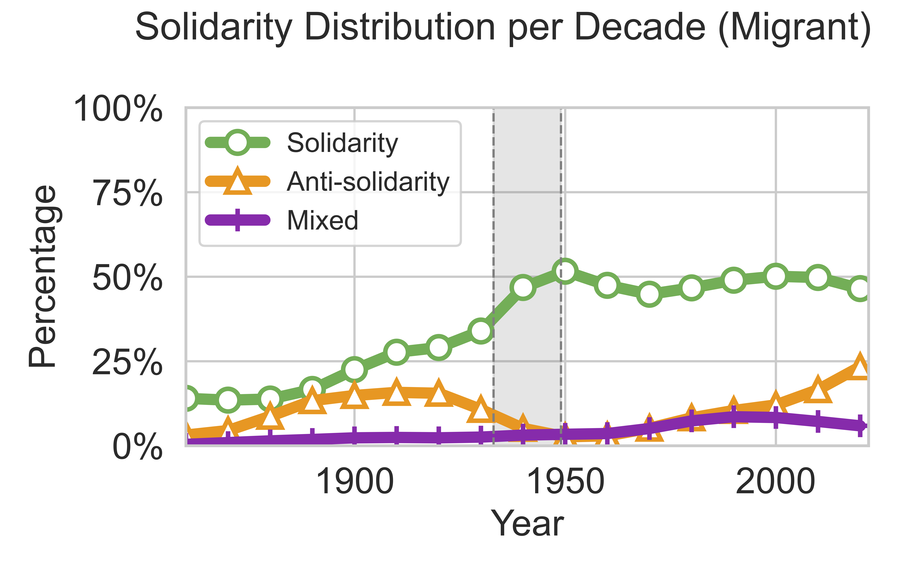

[](https://www.python.org/)
[](./LICENSE)
# FairGer
Data and code for the paper ["Fine-Grained Detection of Solidarity for Women and Migrants in 155 Years of German Parliamentary Debates"](https://aclanthology.org/2024.emnlp-main.337/) by Aida Kostikova, Dominik Beese, Benjamin Paassen, Ole Pütz, Gregor Wiedemann, and Steffen Eger, EMNLP 2024.

<p align="center">
  
  
</p>

## Content

The repository contains the following elements:

- 📂 [Data](./Data)
  - 📂 [Datasets](./Data/Datasets): sentences containing a woman or migrant keyword
  - 📂 [HumanAnnotatedDataset](./Data/HumanAnnotatedDataset): human-annotated benchmark data
  - 📂 [ModelPredictedData](./Data/ModelPredictedData): model-predicted labels
- 📂 [ExperimentsScripts](./ExperimentsScripts): scripts used for training, fine-tuning, and inference experiments
- 📂 [Analysis](./Analysis): code used to generate the plots
- 📂 [archive/arxiv_v1](./archive/arxiv_v1): archived materials corresponding to the earlier arXiv v1 version

See [DominikBeese/DeuParl-v2](https://github.com/DominikBeese/DeuParl-v2) for the full dataset of plenary protocols from the German _Reichstag_ and _Bundestag_.

## License

Unless otherwise noted, the code and documentation in this repository are licensed under the Creative Commons Attribution 4.0 International License (CC BY 4.0).

Materials in [`Data/HumanAnnotatedDataset/`](./Data/HumanAnnotatedDataset/) are subject to separate terms described in that folder’s [`README.md`](./Data/HumanAnnotatedDataset/README.md) and [`LICENSE`](./Data/HumanAnnotatedDataset/LICENSE) files.

## Citation

```
@inproceedings{kostikova-etal-2024-fine,
	title = {Fine-Grained Detection of Solidarity for Women and Migrants in 155 Years of {G}erman Parliamentary Debates},
	author = {Kostikova, Aida and Beese, Dominik and Paassen, Benjamin and P{\"u}tz, Ole and Wiedemann, Gregor and Eger, Steffen},
	year = 2024,
	month = 11,
	booktitle = {Proceedings of the 2024 Conference on Empirical Methods in Natural Language Processing},
	publisher = {Association for Computational Linguistics},
	address = {Miami, Florida, USA},
	pages = {5884--5907},
	doi = {10.18653/v1/2024.emnlp-main.337},
	url = {https://aclanthology.org/2024.emnlp-main.337/},
	editor = {Al-Onaizan, Yaser and Bansal, Mohit and Chen, Yun-Nung},
}
```
> **Abstract:** Solidarity is a crucial concept to understand social relations in societies. In this study, we investigate the frequency of (anti-)solidarity towards women and migrants in German parliamentary debates between 1867 and 2022. Using 2,864 manually annotated text snippets, we evaluate large language models (LLMs) like Llama 3, GPT-3.5, and GPT-4. We find that GPT-4 outperforms other models, approaching human annotation accuracy. Using GPT-4, we automatically annotate 18,300 further instances and find that solidarity with migrants outweighs anti-solidarity but that frequencies and solidarity types shift over time. Most importantly, group-based notions of (anti-)solidarity fade in favor of compassionate solidarity, focusing on the vulnerability of migrant groups, and exchange-based anti-solidarity, focusing on the lack of (economic) contribution. This study highlights the interplay of historical events, socio-economic needs, and political ideologies in shaping migration discourse and social cohesion.
